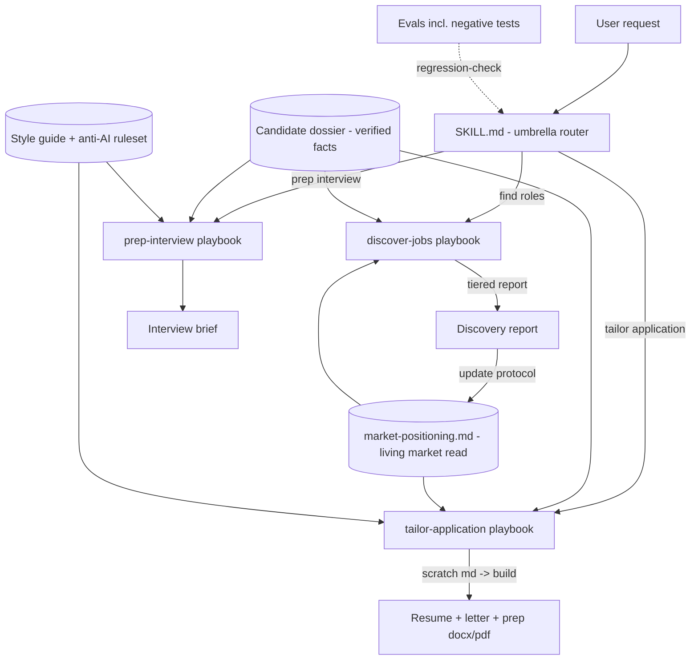

# Agentic Job-Search Orchestration

A production-grade example of using **Claude (chat + Cowork agentic sessions)** to orchestrate a multi-step knowledge workflow end to end: an AI job-search system built as a Claude skill, with capability routing, evidence-grounded generation, a market-signal feedback loop, and eval-driven quality control.

This repo is a **sanitized showcase**. The architecture, skill structure, style ruleset, and evals are the real system; all candidate data has been replaced with fictional examples.

## What the system does

One umbrella skill routes any career-related request to one of three capabilities, each with its own reference playbook:

| Capability | Trigger examples | Output |
|---|---|---|
| **Job discovery** | "find SAP architect roles in Seattle" | Ranked, URL-verified, tiered discovery report |
| **Application tailoring** | "tailor my resume for this posting" | Resume + cover letter + prep doc (docx/pdf), built from an approved baseline |
| **Interview prep** | "prep me for the panel on Thursday" | Company brief + role-fit table + STAR answer cue cards |

Every generated claim must trace to a **verified candidate dossier** (single source of truth). If a claim can't be traced, the system flags it for human confirmation instead of generating it.

## Why it's interesting as agentic orchestration

**1. Source-of-truth hierarchy with conflict resolution.** Facts live in one dossier; process lives in capability playbooks; style lives in one style guide. A precedence rule ("the newest dated decision in the dossier wins") lets the system resolve contradictions between files that drift at different speeds — the failure mode that actually degrades long-running AI workflows.

**2. A closed feedback loop between discovery and generation.** Every discovery run ends by updating a living `market-positioning.md` file (demand lanes, hard gates, tactical rules, distilled from that run's verified evidence). Every tailoring run starts by reading it. The result: applications are positioned against where the market is *moving*, not just against the text of one job description. See [`market-positioning.example.md`](market-positioning.example.md).

**3. Hard-gate screening before generation.** The pipeline refuses to spend effort on unwinnable applications: titled-years minimums the dossier can't meet, PERM-pattern postings (enumerated hyper-specific minimums + a ~$2K-wide salary band), compliance-gated roles, people-manager scope without the record. Refusals are surfaced with rationale and alternates, not silently dropped.

**4. Anti-AI-pattern enforcement at draft time.** Senior recruiters can spot LLM copy. The style ruleset ([`STYLE-RULES.md`](STYLE-RULES.md)) bans the tells — em dashes, signal-flare vocabulary, triadic rhythm, JD-mirroring, capability assertions without evidence — and runs a 7-point self-check before any file is written. Applied at draft time, not as a post-edit.

**5. Eval-driven regression control.** The skill ships with evals ([`evals.example.json`](evals.example.json)) including negative tests: the system must *refuse* correctly (avoid-listed employer, unmeetable minimums) as reliably as it generates correctly.

**6. Human-in-the-loop by design.** Stretch claims are flagged for keep/remove decisions; unverifiable facts are marked for confirmation; where an employer has an AI-usage policy, the system limits itself to analysis inputs so the human writes the first draft.

## Architecture

Full design notes: [`ARCHITECTURE.md`](ARCHITECTURE.md).

## How it was built

Built iteratively with **Claude Cowork** (desktop agentic sessions over the local file system) and **Claude chat**:

- The skill and its reference files are plain Markdown — the "code" of the system is structured natural language, versioned like code.
- Cowork sessions did the heavy operations: sweeping ~390 live postings on an ATS board with per-JD verification fetches, sampling generated packages to diagnose quality drift, consolidating six drifting rule files into a strict hierarchy, and rewriting the skill in place.
- A later optimization pass (also run as an agentic session) found the systemic failure mode — rules duplicated across files obeying different vintages — and fixed it structurally rather than patching outputs. The diagnosis method: sample early / mid / recent outputs and diff them against the current rule set.

## Measured behavior (from the live system)

- 49 tailored application packages generated over ~7 weeks, each with alignment analysis and JD snapshot.
- Output drift diagnosis: early packages violated 6+ of the current hard rules; the newest violated ~2 soft rules — improvement tracked to rule consolidation, not model change.
- Discovery runs enforce URL verification (live/unverified/dead labels) after SERP-sourced dead links were caught in an early eval.

## Repo contents

| File | What it is |
|---|---|
| [`SKILL.example.md`](SKILL.example.md) | The umbrella skill, sanitized: routing, constraints, source-of-truth hierarchy, workflow |
| [`market-positioning.example.md`](market-positioning.example.md) | The living market-read file with its update protocol |
| [`STYLE-RULES.md`](STYLE-RULES.md) | The full anti-AI writing ruleset (generic, reusable) |
| [`evals.example.json`](evals.example.json) | Eval suite structure, including negative tests |
| [`ARCHITECTURE.md`](ARCHITECTURE.md) | Design notes: hierarchy, feedback loop, gates, build pipeline |

## Adapting it

The pattern generalizes to any recurring document-generation workflow with a truth source and a quality bar (sales proposals, grant applications, compliance responses): put facts in one dossier, process in per-capability playbooks, style in one enforced ruleset, wire outputs back into a living context file, and hold it together with evals that test the refusals as much as the generations.

## License

MIT — see [LICENSE](LICENSE).
